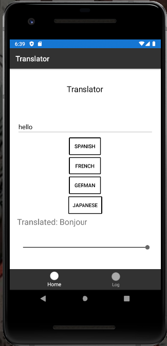

# Translator

**Author**: Scott Falbo
**Version**: 1.0.0 

## Overview
An easy to use app that allows the user to enter a word or phrase, and then choose from a list languages.  The input is translated into text, and spoken back to the user.  The original input, language it was translated to, and translated phrase, are all saved to a database and available in the Log view.

---

## Getting Started
+ `git clone https://github.com/scottfalbo/kitty-cat-app`
  + You will need an Android emulator to run the app from Visual Studio.
  + The App also requires a personal `key` for Azure's Cognitive Services.  The key needs to be entered into the `key` variable in the `HomeViewModel.cs`
+ Once the App is running just enter a phrase and choose the language you wish to translate to.

---

## Example

---

## Architecture
+ This is a .NET project built with Xamarin in Visual Studio.  
+ It utilizes a SQlite database for storing user data.  
+ The translation is done through Azure Cognitive Services API.
+ The spoken voice is through Androids `TextToVoice()`
+ NewtonSoftJson for parsing database input and output.

---

## Change Log
+ *03/02/2021* 
  + Set up the app with basic navigation.
  + Did a little bit of styling.
+ *03/05/2021*
  + Wired up the phones TextToVoice feature and created a text entry form.
  + Wired up the database for later use.
  + Created request to Azure Cognitive Services API.
+ *03/06/2021*
  + Parsed the API results into usable data.
  + Sent the translated text, as well as the locale to the TextToVoice method.
  + Added options for four languages.
  + Declared a method to save the entires into the database as the user translates phrases.

---

## Attribution 
[John Cokos' Xamarin Demo Code](https://github.com/codefellows/seattle-dotnet-401d12/tree/master/class-39/demo/XDemo/XDemo/XDemo) 
[Azure API request](https://docs.microsoft.com/en-us/azure/cognitive-services/translator/quickstart-translator?tabs=csharp) 
[Json parsing](https://social.msdn.microsoft.com/Forums/office/en-US/df1d6c1b-349a-4f7f-9168-5bf01d320075/how-to-get-keyvalue-pair-from-json-jarray?forum=csharpgeneral) 
